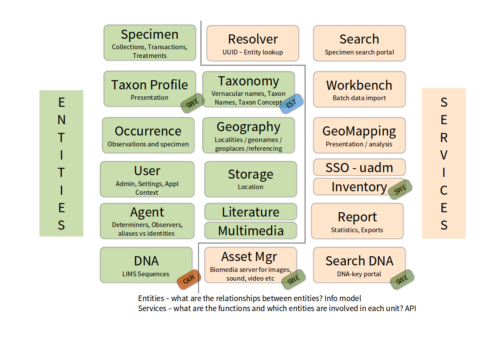
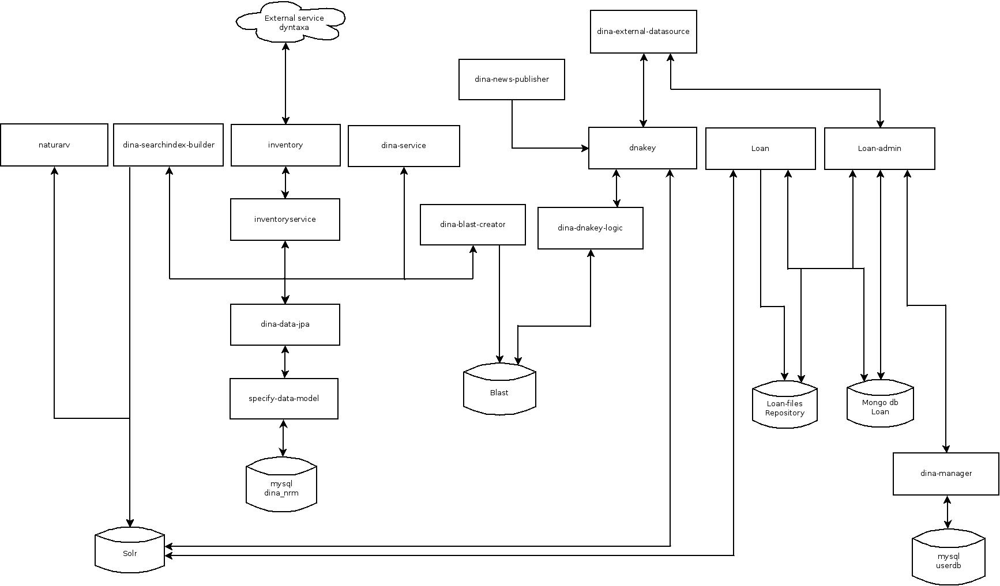

# The DINA information model

This space captures discussions about the information model and ideas about changes. Please add your materials to this repo!

# DINA-Web infrastructure

Please see [Infrastructure](infrastructure.Rmd) for an overview of the technology stack that the DINA system runs on.

# High level system overview

See modules.odg for high level map of some possible data types and services....

# Information model for core parts of DINA system

